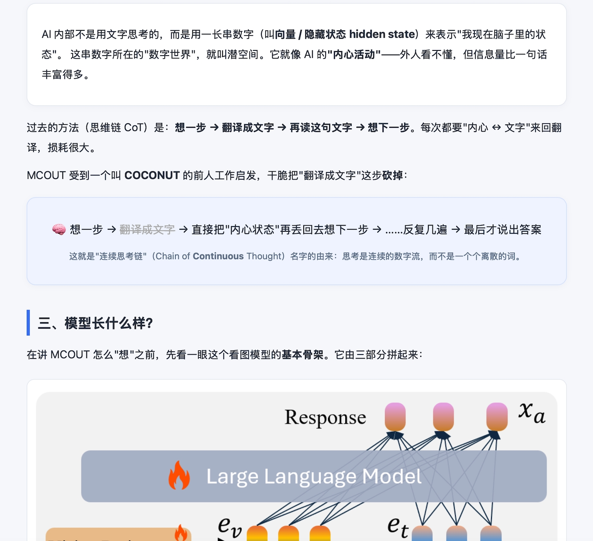

<div align="center">

# 📄 → 🌐 paper_html

**Turn any academic paper into an HTML explainer a complete outsider can understand**

A skill for both **Claude Code** and **Codex** —
give it an arXiv ID / URL / PDF / or just a title, and it auto-downloads, archives, and writes a plain-language explainer web page with figures.

[](LICENSE)


[](https://github.com/feng1201/paper_html/stargazers)

[中文](README.md) · **English**

**📑 Example HTML output:**



<sub>↑ A slice of the explainer auto-generated for the paper MCOUT (arXiv:2508.12587)</sub>

</div>

---

## ✨ What it does

Give it a paper, and it automatically:

1. **📥 Downloads & archives** — the PDF, the arXiv LaTeX source, and the original figures, sorted into folders.
2. **📖 Reads the paper** — extracts the pain point, core idea, method, results, and limitations.
3. **🌐 Writes an HTML explainer** — plain words + everyday analogies + figures + a results table + an FAQ. **Self-contained, openable offline.**

> The explainer's **language follows your conversation language**: talk to the agent in Chinese and it produces Chinese; otherwise it defaults to English.
>
> This skill was built with the help of Codex and Claude Code.

---

## 🎯 Supported inputs (pick any)

| What you have | How you pass it |
|---|---|
| arXiv ID | `2508.12587` |
| arXiv URL | `https://arxiv.org/abs/2508.12587` (abs/pdf/html all fine) |
| PDF URL | `https://xxx.com/paper.pdf` |
| Local PDF file | `/path/to/paper.pdf` |
| Only a title | `Multimodal Chain of Continuous Thought` (it searches and confirms with you first) |

Output layout:

```
<paper-name>/
├── pdf/                       original paper PDF
├── tex/                       arXiv LaTeX source (with original figures)
└── html/
    ├── images/                original figures
    └── keyword-abbrev.html    the explainer (e.g. latent-reasoning-MCOUT.html)
```

---

## 🚀 Install & use

<details open>
<summary><b>① Claude Code</b></summary>

```bash
git clone https://github.com/feng1201/paper_html.git
# user-level (available everywhere):
ln -s "$(pwd)/paper_html" ~/.claude/skills/paper-html
# or project-level:
ln -s "$(pwd)/paper_html" <your-project>/.claude/skills/paper-html
```

Then in Claude Code, just ask, or use the skill:

```
/paper-html 2508.12587
Read https://arxiv.org/abs/2508.12587 and write an easy explainer web page
```
</details>

<details>
<summary><b>② Codex</b></summary>

```bash
git clone https://github.com/feng1201/paper_html.git
export PAPER_HTML_DIR="$(pwd)/paper_html"          # recommend adding to ~/.zshrc / ~/.bashrc
cp paper_html/prompts/paper-html.md ~/.codex/prompts/paper-html.md
# open ~/.codex/prompts/paper-html.md and set $PAPER_HTML_DIR to the real path above
```

Then in Codex:

```
/paper-html 2508.12587
```
</details>

<details>
<summary><b>③ As a plain script (any environment)</b></summary>

Just want to download a paper and write the explainer yourself:

```bash
bash scripts/fetch_paper.sh 2508.12587 MCOUT_latent_reasoning ./papers
```
</details>

---

## 🧩 Repo layout

```
paper_html/
├── README.md / README.en.md   Chinese (default) / English
├── SKILL.md                   Claude Code entry (skill definition)
├── prompts/paper-html.md      Codex entry (/paper-html command)
├── reference/
│   ├── workflow.md            core flow (single source of truth, shared)
│   ├── writing-style.md       writing-style guide (how to stay approachable)
│   └── template.html          HTML template (with self-contained color CSS)
├── scripts/fetch_paper.sh     download script (PDF + source + figures)
└── examples/                  sample output (MCOUT explainer)
```

Both entry points are thin shells; the real method lives in `reference/` — **edit one place, both tools update.**

---

## 💡 Design principles

- **Explain it to a beginner** — every term gets an explanation and an analogy; equations become plain words.
- **Beautiful** — card-based layout, harmonious colors, responsive on phone and desktop; pleasant to read, not intimidating.
- **Honest** — the paper's limitations and failure findings are spelled out, with why they matter.
- **Self-contained** — images and styles are embedded; openable offline; no external image hosts.
- **Faithful numbers** — all data defers to the original PDF.

---

## 📜 License

[MIT](LICENSE) © [feng1201](https://github.com/feng1201)
